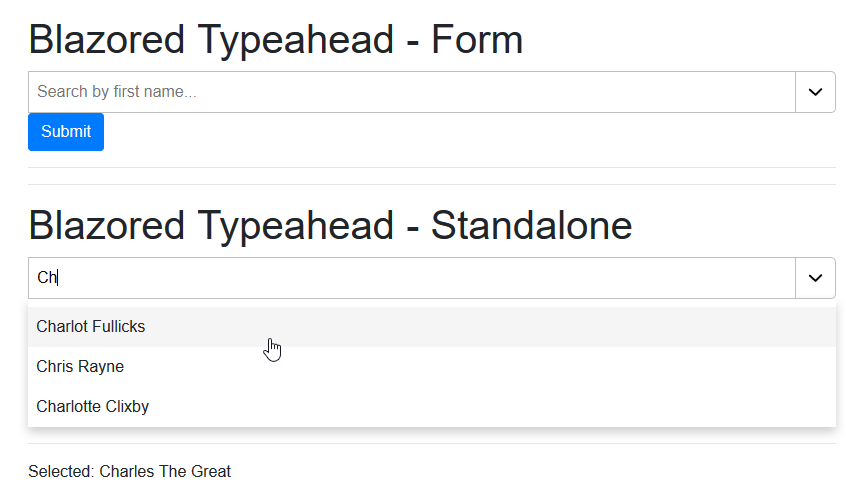

# Blazored Typeahead
Typeahead control for Blazor applications.




### Installing

You can install from NuGet using the following command:

`Install-Package Blazored.Typeahead`

Or via the Visual Studio package manger.

### Setup
Blazor Server applications will need to include the following CSS and JS files in their `_Host.cshtml` .

Blazor Client applications will need to include the following CSS and JS files in their `Index.html` .

In the `head` tag add the following CSS.

```html
<link href="_content/Blazored.Typeahead/blazored-typeahead.css" rel="stylesheet" />
```

Then add the JS script at the bottom of the page using the following script tag.

```html
<script src="_content/Blazored.Typeahead/blazored-typeahead.js"></script>
```

I would also suggest adding the following using statement to your main `_Imports.razor` to make referencing the component a bit easier.

```cs
@using Blazored.Typeahead
```

## Usage
The component can be used standalone or as part of a form. When used in a form the control fully integrates with Blazors forms and authentication system.

Below is a list of all the options available on the Typeahead.

**Templates**

- `ResultTemplate` (Required) - Allows the user to define a template for a result in the results list
- `SelectedTemplate` (Required) - Allows the user to define a template for a selected item
- `HelpTemplate` - Allows the user to define a template to show when the `MinimumLength` to perform a search hasn't been reached
- `NotFoundTemplate` - Allows the user to define a template when no items are found
- `FooterTemplate` - Allows the user to define a template which is displayed at the end of the results list

**Parameters**

- `MinimumLength` (Optional - Default: 1) - Minimum number of characters before starting a search
- `Debounce` (Optional - Default: 300) - Time to wait after last keypress before starting a search
- `MaximumSuggestions` (Optional - Default: 10) - Controls the amount of suggestions which are shown
- `Disabled` (Optional - Default: `false`) - Marks the control as disabled and stops any interaction
- `EnableDropDown` (Optional - Default: `false`) - Allows the control to behave as a dropdown
- `DisableClear` (Optional - Default : `false`) - Hides the clear button from the Typeahead. Users can still change the selection by clicking on the current selection and typing however, they can't clear the control entirely.'
- `ShowDropDownOnFocus` (Optional - Default: `false`) - When enabled, will show the suggestions dropdown automatically when the control is in search mode. If the control has a current value then the user would need to press the enter key first to enter search mode.
- `StopPropagation` (Optional - Default: `false`) - Control the StopPropagation behavior of the input of this component. See https://docs.microsoft.com/en-us/aspnet/core/blazor/components?view=aspnetcore-3.1#stop-event-propagation
- `PreventDefault` (Optional - Default: `false`) - Control the PreventDefault behavior of the input of this component. See https://docs.microsoft.com/en-us/aspnet/core/blazor/components?view=aspnetcore-3.1#prevent-default-actions

The control also requires a `SearchMethod` to be provided with the following signature `Task<IEnumerable<TItem>>(string searchText)`. The control will invoke this method 
passing the text the user has typed into the control. You can then query your data source and return the result as an `IEnumerable` for the control to render.

If you wish to bind the result of the selection in the control to a different type than the type used in the search this is also possible. For example, if you passed in a list
of `Person` but when a `Person` was selected you wanted the control to bind to an `int` value which might be the `Id` of the selected `Person`, you can achieve this by providing
a `ConvertMethod` The convert method will be invoked by the control when a selection is made and will be passed the type selected. The method will need to handle the conversion
and return the new type.

If you want to allow adding an item based on the search when no items have been found, you can achieve this by providing the `AddItemOnEmptyResultMethod` as a parameter.
This method will make the `NotFoundTemplate` selectable the same way a item would normally be, and will be invoked when the user selects the `NotFoundTemplate`.
This method passes the `SearchText` and expects a new item to be returned.

### Local Data Example
```cs
<EditForm Model="MyFormModel" OnValidSubmit="HandlValidSubmit">
    <BlazoredTypeahead SearchMethod="SearchFilms"
                            @bind-Value="MyFormModel.SelectedFilm">
        <SelectedTemplate>
            @context.Title
        </SelectedTemplate>
        <ResultTemplate>
            @context.Title (@context.Year)
        </ResultTemplate>
    </BlazoredTypeahead>
    <ValidationMessage For="@(() => MyFormModel.SelectedFilm)" />
</EditForm>

@code {

    [Parameter] protected IEnumerable<Film> Films { get; set; }

    private async Task<IEnumerable<Film>> SearchFilms(string searchText) 
    {
        return await Task.FromResult(Films.Where(x => x.Title.ToLower().Contains(searchText.ToLower())).ToList());
    }

}
```
In the example above, the component is setup with the minimum requirements. You must provide a method which has the following signature `Task<IEnumerable<T> MethodName(string searchText)`, to the `SearchMethod` parameter. The control will call this method with the current search text everytime the debounce timer expires (default: 300ms). You must also set a value for the `Value` parameter. This will be populated with the item selected from the search results. As this version of the control is integrated with Blazors built-in forms and validation, it must be wrapped in a `EditForm` component.

The component requires two templates to be provided...

- `SelectedTemplate`
- `ResultTemplates`

The `SelectedTemplate` is used to display the selected item and the `ResultTemplate` is used to display each result in the search list.


### Remote Data Example

```cs
@inject HttpClient httpClient

<BlazoredTypeahead SearchMethod="@SearchFilms"
                   @bind-Value="@SelectedFilm"
                   Debounce="500">
    <SelectedTemplate>
        @context.Title
    </SelectedTemplate>
    <ResultTemplate>
        @context.Title (@context.Year)
    </ResultTemplate>
    <NotFoundTemplate>
        Sorry, there weren't any search results.
    </NotFoundTemplate>
</BlazoredTypeahead>

@code {

    [Parameter] protected IEnumerable<Film> Films { get; set; }

    private async Task<IEnumerable<Film>> SearchFilms(string searchText) 
    {
        var response = await httpClient.GetJsonAsync<IEnumerable<Film>>($"https://allfilms.com/api/films/?title={searchText}");
        return response;
    }

}
```
Because you provide the search method to the component, making a remote call is really straight-forward. In this example, the `Debounce` parameter has been upped to 500ms and the `NotFoundTemplate` has been specified.

### Subscribing to changes in selected values
It is common to want to be able to know when a value bound to the Typeahead changes. To do this you can't use the standard `@bind-Value` or `@bind-Values` syntax, you must handle the change event manually. To do this you must specify the following parameters:

- Value
- ValueChanged
- ValueExpression
- TValue & TItem (these are not always necessary)

The code below shows an example of how these parameters should be used.

```razor
<BlazoredTypeahead SearchMethod="SearchPeople"
                   TValue="Result"
                   TItem="Result"
                   Value="selectedResult"
                   ValueChanged="SelectedResultChanged" 
                   ValueExpression="@(() => selectedResult)"
                   placeholder="Search by name...">
</BlazoredTypeahead>

@code {
    private MovieCredits movieCredits;
    private Result selectedResult;

    private async Task<IEnumerable<Result>> SearchPeople(string searchText)
    {
        var search = await client.SearchPerson(searchText);
        return search.Results;
    }

    private async Task SelectedResultChanged(Result result)
    {
        selectedResult = result;
        movieCredits = await client.GetPersonMovieCredits(result.Id);
    }
}
```

### Using complex types but only binding to a single property
There are times when you will want to use complex types with the Typeahead but only bind a certain property of that type. For example, you may want to search against a `Person` but once a person is selected, only bind to it's `Id` property. In order to do this you will need to implement the following:

```razor
<BlazoredTypeahead SearchMethod="GetPeopleLocal"
                   ConvertMethod="ConvertPerson"
                   @bind-Value="SelectedPersonId"
                   placeholder="Search by first name...">
    <SelectedTemplate Context="personId">
        @{
            var selectedPerson = LoadSelectedPerson(personId);

            <text>@selectedPerson?.Firstname @selectedPerson?.Lastname</text>
        }
    </SelectedTemplate>
    <ResultTemplate Context="person">
        @person.Firstname @person.Lastname (Id: @person.Id)
    </ResultTemplate>
</BlazoredTypeahead>

@code {
    private List<Person> People = new List<Person>();

    protected override void OnInitialized()
    {
        People.AddRange(new List<Person>() {
            new Person() { Id = 1, Firstname = "Martelle", Lastname = "Cullon" },
            new Person() { Id = 2, Firstname = "Zelda", Lastname = "Abrahamsson" },
            new Person() { Id = 3, Firstname = "Benedetta", Lastname = "Posse" }
        });
    }

    private async Task<IEnumerable<Person>> GetPeopleLocal(string searchText)
    {
        return await Task.FromResult(People.Where(x => x.Firstname.ToLower().Contains(searchText.ToLower())).ToList());
    }

    private int? ConvertPerson(Person person) => person?.Id;

    private Person LoadSelectedPerson(int? id) => People.FirstOrDefault(p => p.Id == id);
}

```